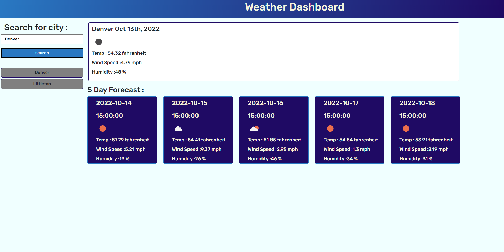

# weather-dashboard

## Description

This project was created to be able to search for cities and observe their weather. It enables the user to look at the weather for the upcoming 5 days as well, helping the user to plan a trip.

## Installation

n/a

## Usage

https://tab-y.github.io/weather-dashboard/

## Credits

n/a

## License

See license in repo.

